# Vocallabs.ai — Product Teardown


> A product teardown of **Vocallabs.ai** (AI voice agents) for the Product Intern assignment.
> Instead of grading the polish of the marketing site, this teardown does something most reviews don't: it **takes Vocallabs' own four claimed moats and stress-tests each one against evidence** — the live website, the Android app, the Chrome extension, the public API docs, and the company's own open-source code on GitHub.
>
> **The one-line takeaway:** Vocallabs presents as *"Voice AI infrastructure for developers"*, but underneath it is a **sales-gated orchestration layer running on Subspace's backend**, where the headline developer surfaces (self-serve signup, the app, the extension, the docs' response schemas) are either missing, broken, or unshipped. The good news: almost every issue is fixable, and there is a *real* moat hiding under the marketing one.

---

## Table of contents

1. [TL;DR — the 60-second read](#1--tldr--the-60-second-read)
2. [How I tested (and what I couldn't)](#2--how-i-tested-and-what-i-couldnt)
3. [Plain-English glossary](#3--plain-english-glossary)
4. [What Vocallabs actually is — the architecture](#4--what-vocallabs-actually-is--the-architecture)
5. [The Moat Audit — testing their 4 claimed moats](#5--the-moat-audit--testing-their-4-claimed-moats)
6. [The 10 findings](#6--the-10-findings)
7. [Prioritisation — what to fix first, and why](#7--prioritisation--what-to-fix-first-and-why)
8. [What I'd genuinely keep (strengths)](#8--what-id-genuinely-keep-strengths)
9. [Frameworks & deep dives](#9--frameworks--deep-dives)
10. [Repository map](#10--repository-map)

---

## 1 · TL;DR — the 60-second read

- **What it is:** Vocallabs sells AI voice agents that make and take business phone calls (sales, support, booking). The website pitches it as developer infrastructure that "scales from zero to millions of concurrent calls."
- **What I did:** Used every public surface like a real customer — and, because Vocallabs open-sources its SDK, n8n node and an app, I also **read their code and their full API docs**. That combination is what surfaced the non-obvious findings.
- **The sharpest finding (F2):** The product is, on the evidence, an **orchestration layer over third-party models** (Deepgram for speech-to-text, swappable LLMs, third-party TTS voices) running on **Subspace's backend** (`api1.superflow.run`, Hasura, a "green-balance" wallet). That directly tests their claim of *"proprietary conversation intelligence."*
- **The most damaging finding (F8):** On the public Android app, the core action — placing a call — **fails with a raw backend error leaked to the user**.
- **The structural finding (F1):** Despite "for developers / get started in 2 mins," there is **no self-serve signup anywhere** — every button leads to a sales demo.
- **Coverage:** 10 findings spread across all five product pillars (GTM & ICPs, Competitor Analysis, Features/Services, UX, Potential Collaborations) — not stacked in one area.
- **Balance:** This is not a hit piece. Vocallabs has a genuinely **broad API** and one **real India-first moat** (in-call Aadhaar/PAN identity verification) that I'd tell them to double down on. See [Strengths](#8--what-id-genuinely-keep-strengths).

---

## 2 · How I tested (and what I couldn't)

**Submitted by:** Rohan ([@rohanbalu05](https://github.com/rohanbalu05)) · Co-founder, **AIz Yantra**.

**Surfaces I exercised:**

| Surface | What I did |
|---|---|
| `vocallabs.ai` website | Walked the full funnel: Home → Solutions → Docs → "Get Started" → Contact. |
| Contact / demo flow | Confirmed the *only* way in is a human demo request. |
| Android app ("Vocallabs") | Installed, attempted a real call, captured the failure. |
| Chrome extension | Tried to install from the official Chrome Web Store. |
| API docs (`docs.vocallabs.ai`) | Read the full 65-page reference end-to-end. |
| Public GitHub org (`github.com/Vocallabsai`) | Read the SDK, the n8n node + its bundled API docs, the `vocalflow` app, and the extension repo. |

**What I could *not* access — and why that is itself a finding:** I could not test a live AI agent call. There is **no self-serve way to get API credentials** (they are provisioned only after a sales demo), and a demo could not be arranged inside the assignment window. So the deepest technical claims (audio quality, barge-in, "emotion/tone" analytics) are assessed from **their own code and API**, and flagged as *evidence-based but not live-verified* where relevant (see F4, F10). The access wall itself is **Finding F1**.

> **A note on method:** Because the depth here comes partly from reading Vocallabs' public code, every technical claim is tied to a specific file, endpoint, or screenshot. Nothing in this teardown requires you to take my word for it.

---

## 3 · Plain-English glossary

This teardown is written so a junior engineer (or a non-engineer) can follow every point. Quick definitions for the terms used below:

- **Self-serve / PLG (product-led growth):** You can sign up and start using the product yourself, instantly, without talking to a salesperson. The opposite is "sales-gated."
- **ASR (speech-to-text):** Software that turns spoken audio into text. (Vocallabs appears to use **Deepgram** for this.)
- **TTS (text-to-speech):** Software that turns text into a spoken voice.
- **LLM:** The "brain" (e.g. GPT, Claude, Llama) that decides what the agent says next.
- **Orchestration layer:** A product that doesn't build its own ASR/LLM/TTS, but *wires together* other companies' models and adds workflow on top.
- **Half-duplex vs full-duplex audio:** Half-duplex = only one side can "talk" at a time (like a walkie-talkie). Full-duplex = both sides can talk and listen at once (like a real phone call). Full-duplex is what makes an agent feel human and lets you interrupt it ("barge-in").
- **Hasura:** An off-the-shelf tool that auto-generates a GraphQL API over a database. Seeing it means parts of the backend are built on Hasura.
- **SIP / DID:** Telephony plumbing. SIP is the protocol for internet phone calls; a DID is a phone number you can rent.
- **Sample rate (8 kHz / 16 kHz):** How much audio detail is captured. 8 kHz is old-school phone quality; 16 kHz+ sounds clearer.

---

## 4 · What Vocallabs actually is — the architecture

The marketing says "full-stack ownership." The evidence (their API docs + their open-source app) points to a different, more honest picture: **client apps → Subspace's backend → third-party AI models.**

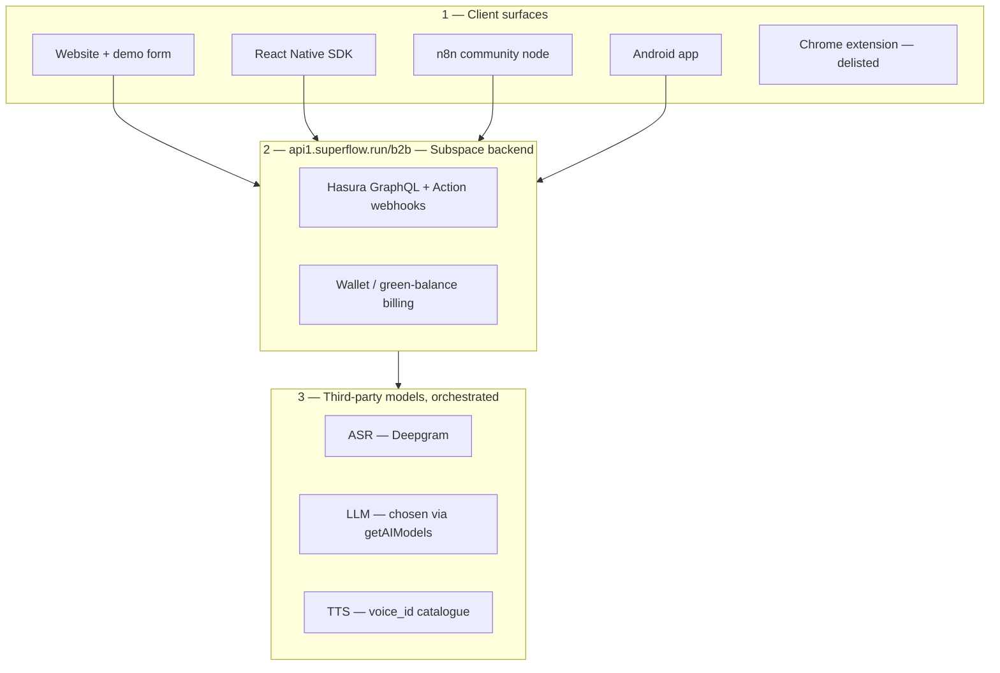

**How I know each box (evidence):**

- **`api1.superflow.run`, Hasura, wallet:** Every endpoint in the official docs is served from `api1.superflow.run/b2b/...` — *not* `vocallabs.ai`. The docs include `getGreenBalance` and `whatsubTransactionHistory` (a wallet ledger). "WhatSub" was Subspace's original product name; "Superflow" is Subspace's backend. The Android app's crash exposes a **Hasura GraphQL** error. A `402 — insufficient balance` error on billable endpoints confirms the **pay-per-call wallet**.
- **Deepgram + swappable LLM + TTS catalogue:** The API exposes `getAIModels` (you pick the LLM), `voice_id` and `getVoicesByLanguageComment` (a TTS voice catalogue), and per-agent `analytics_prompt` (analytics is *a prompt over a transcript*). Vocallabs' own open-source `vocalflow` app documents its stack as **Deepgram (ASR) + Groq/OpenRouter (LLM)** — strong evidence for the same orchestration approach in the core product.

This architecture isn't bad — orchestration is a legitimate, fast way to build. The problem is only that it **contradicts the "proprietary / full-stack" story** the company tells. See the Moat Audit next.

---

## 5 · The Moat Audit — testing their 4 claimed moats

The assignment lists Vocallabs' four claimed moats. Here is each one, tested against evidence. This is the spine of the whole teardown.

| # | Claimed moat (their words) | Verdict | Why | Finding |
|---|---|---|---|---|
| 1 | **Full-stack ownership** + **data flywheel: proprietary conversation intelligence** | ⚠️ **Overstated** | The stack orchestrates Deepgram + swappable LLMs; "analytics beyond transcription" is an LLM prompt over a transcript. Real data is captured, but the *intelligence* is third-party. | [F2](#f2--proprietary-conversation-intelligence-is-mostly-orchestration-over-third-party-models-) |
| 2 | **India-first: tuned for local languages, accents & workflows** | 🟡 **Mixed** | One part is a **genuine moat** — in-call **Aadhaar/PAN KYC** competitors don't have. The "tuned languages" part looks like prompt-based transliteration on third-party ASR, not proprietary India-tuned models. | [F2](#f2--proprietary-conversation-intelligence-is-mostly-orchestration-over-third-party-models-) / [Strengths](#8--what-id-genuinely-keep-strengths) |
| 3 | **Founder conviction (post-Subspace)** | ✅ **Confirmed — but it is a dependency too** | The product literally runs on Subspace's `superflow.run` + wallet rails. That is real leverage (speed, lower cost) **and** a structural coupling/single-point-of-failure risk. | [F2](#f2--proprietary-conversation-intelligence-is-mostly-orchestration-over-third-party-models-) |
| 4 | **Data flywheel at scale** | 🟡 **Partial** | They do capture every conversation (a real asset), but nothing observed turns that into a defensible, compounding model advantage yet. | [F2](#f2--proprietary-conversation-intelligence-is-mostly-orchestration-over-third-party-models-) / [F10](#f10--validate-or-puncture-the-emotiontone-analytics-claim-on-a-live-call-reserved) |

**Bottom line:** three of the four moats are weaker than advertised, and the *strongest real moat they have (India KYC) isn't even in their moat list.* That's a strategic mispositioning, not just a feature gap.

---

## 6 · The 10 findings

Each finding follows the assignment's structure — **(a) Observed → (b) Problem → (c) Ship instead** — plus a severity and effort rating so the team can prioritise.

**Severity:** 🔴 Critical · 🟠 High · 🟡 Medium · ⚪ Low  **Effort:** how much work the fix is (Low / Med / High).

| # | Finding | Pillar | Severity | Effort |
|---|---|---|---|---|
| F1 | No self-serve signup, yet positioned "for developers" | GTM & ICPs · UX | 🟠 High | Med |
| F2 | "Proprietary intelligence" is mostly third-party orchestration | Competitor Analysis | 🟠 High | High |
| F3 | Polished API docs, but hollow (no response schemas, bugs) | Features · Dev UX | 🟠 High | Med |
| F4 | Half-duplex audio likely weakens "human-like" interruption | Features · Competitor | 🟡 Medium | High |
| F5 | The public GitHub org sends an incoherent brand signal | GTM · Brand | ⚪ Low | Low |
| F6 | Chrome extension is delisted & only on ad-laden mirror sites | Features · UX · Trust | 🟡 Medium | Low |
| F7 | A developer test-app is shipped to the public Play Store | GTM · UX | 🟡 Medium | Low |
| F8 | Core call fails; raw backend error shown to the user | Features · Reliability | 🔴 Critical | Med |
| F9 | "Booking" agents have no scheduler; WhatsApp is notify-only | Potential Collaborations | 🟡 Medium | High |
| F10 | "Emotion/tone" analytics needs live validation | Competitor · Features | 🟡 Medium | — |

---

### F1 · No self-serve signup, yet positioned "for developers"
**Pillar:** GTM & ICPs · UX  **Severity:** 🟠 High  **Effort:** Medium

**(a) Observed.** The homepage positions Vocallabs as *"Voice AI infrastructure for developers… that scales from zero to millions of concurrent calls,"* and the top CTA reads **"Get Started ⚡ 2 mins."** But every CTA — "Get Started," "Talk to an Expert," "Schedule Your Free Demo" — leads to the same **sales/demo form**. There is no signup, no free tier, no instant API key anywhere on the site, in the docs, or in the repos. Meanwhile the docs and GitHub clearly show a developer console exists (it issues `clientId`/`clientSecret`).

<p>
  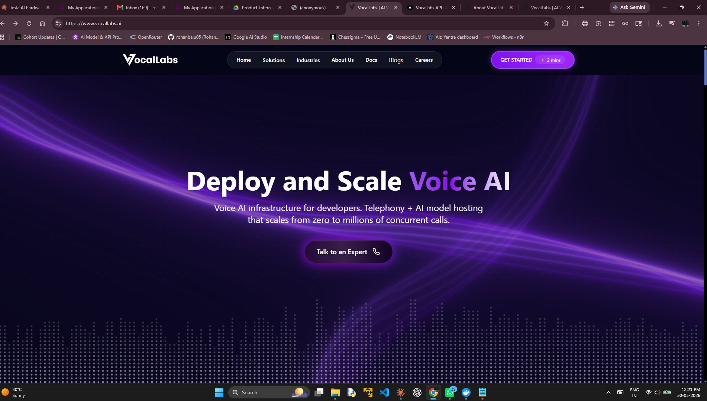
  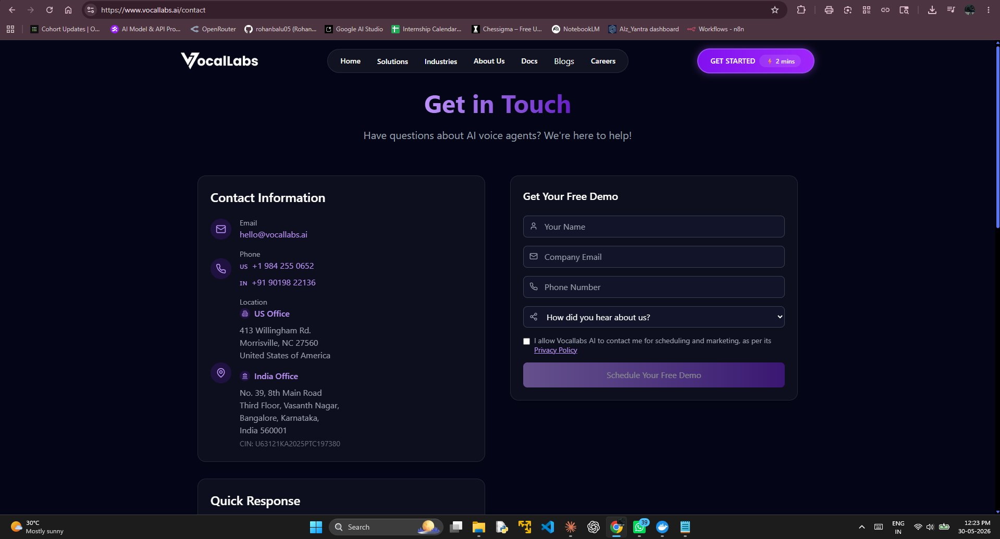
</p>

> 🔍 **What to look at:** the homepage promises developer self-serve and "2 mins"; the only actual door (right) is a sales demo form.

**(b) Problem.** Developers — the *stated* ideal customer — self-serve. They evaluate by getting a key and making a test call in minutes. A sales wall makes the high-intent developer bounce immediately, and the "2 mins / from zero" copy sets a promise the funnel then breaks (worst of both worlds: wrong promise *and* wrong motion). Direct competitors (Vapi, Retell, Bland, Synthflow) all hand you a free API key in ~60 seconds, so the comparison shopper is gone before a salesperson ever calls back. **In plain terms:** the website invites developers in, then locks the only door.

**(c) Ship instead.** Pick one identity and align the funnel to it:
- *If the real ICP is developers:* expose the existing console behind "Get Started" with a **free sandbox tier + instant API key** (even rate-limited). This is the single highest-leverage change for the dev ICP.
- *If the real motion is enterprise sales:* drop "for developers / 2 mins / from zero," and reposition honestly as **managed enterprise voice**, so the message matches the funnel.

---

### F2 · "Proprietary conversation intelligence" is mostly orchestration over third-party models ⭐
**Pillar:** Competitor Analysis / Moats  **Severity:** 🟠 High (strategic)  **Effort:** High

**(a) Observed.** Three independent pieces of evidence converge:
1. **It runs on Subspace's backend.** The official docs serve every endpoint from `api1.superflow.run/b2b/...`, and include `getGreenBalance` + `whatsubTransactionHistory` — Subspace's ("WhatSub") wallet. A `402 — insufficient balance` error gates billable calls.
2. **It orchestrates swappable models.** The API exposes `getAIModels` (choose the LLM), a `voice_id` TTS catalogue, and per-agent `analytics_prompt` (so "analytics" = an LLM prompt run over the transcript).
3. **Their own app reveals the stack.** Vocallabs' open-source `vocalflow` app documents **Deepgram (ASR) + Groq/OpenRouter (LLM)**.

<p>
  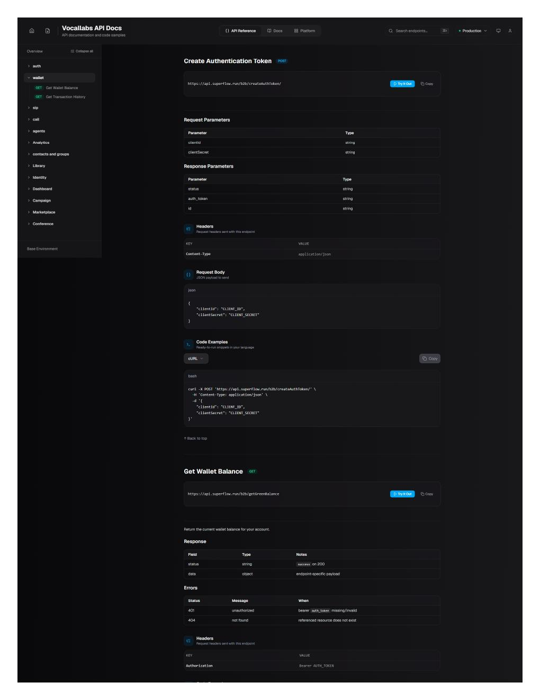
</p>

> 🔍 **What to look at:** the endpoint is `api1.superflow.run/b2b/createAuthToken` — Subspace's backend — and just below it, `getGreenBalance` (a wallet). This is not a `vocallabs.ai` API; it's a voice product layered on Subspace's rails.

**(b) Problem.** The brand sells *"full-stack ownership"* and *"proprietary conversation intelligence,"* and the site claims *"emotion, intent & tone beyond transcription."* The evidence says this is **prompts over Deepgram transcripts on third-party LLMs** — a capability a competent team can rebuild in weeks. The moat narrative is therefore fragile to anyone (a technical buyer, an investor's diligence) who looks one layer down. The Subspace coupling is simultaneously a strength (speed, shared cost) and a **single-point-of-failure / strategic-dependency risk**. **In plain terms:** they're marketing a deep moat where the evidence shows a shallow one — and hiding their *actual* moat (see Strengths).

**(c) Ship instead.** Two honest paths:
- *Make the moat real and visible:* ship one thing competitors can't trivially copy — e.g. **India-accent-tuned ASR**, **acoustic emotion detection from the waveform** (not the transcript), and publish a benchmark.
- *Reposition around the true moat:* orchestration *speed* + **India telephony + Aadhaar/PAN KYC** + the Subspace data/billing rails. Stop claiming proprietary intelligence that can't be demonstrated.

> **Honesty note:** I could not run a live call, so the model-stack claim is a strong, evidence-backed inference (from `getAIModels` + the `vocalflow` stack), not a lab-proven fact. F10 is the live test that would convert it to proof.

---

### F3 · Polished API docs, but hollow underneath
**Pillar:** Features / Developer UX  **Severity:** 🟠 High  **Effort:** Medium

**(a) Observed.** The docs *portal* looks great — clean tables, multi-language code samples, a "Try it Out" runner. But the substance is thin and buggy:
- **Response bodies are undocumented.** Every endpoint lists its response as the same generic `data: object · "endpoint-specific payload."` You can authenticate but never learn what fields actually come back.
- **Errors are copy-pasted boilerplate** (the same 401/400/402/404 block on every endpoint).
- **Method bugs:** "Add multiple contacts to group" is labelled **POST** but its code sample is `curl -X GET`, with a description about creating a *single* contact.
- **Insomnia artifacts leak through:** examples still carry `User-Agent: insomnia/12.0.0` — i.e. the docs are exported from the Insomnia REST client, not authored.

<p>
  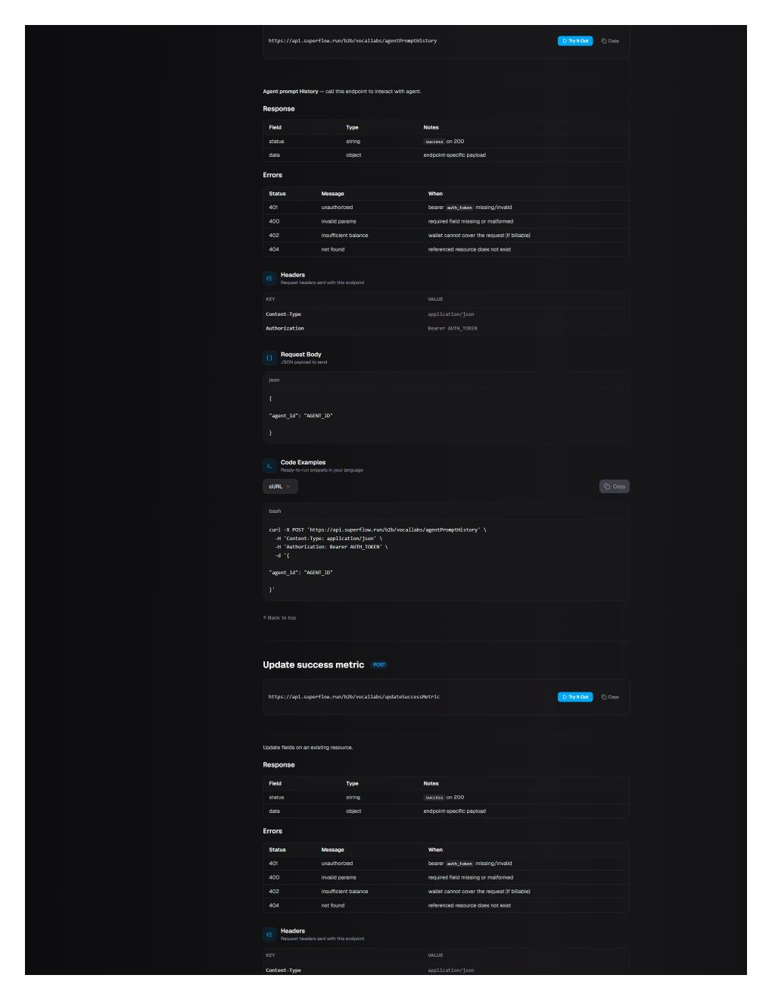
  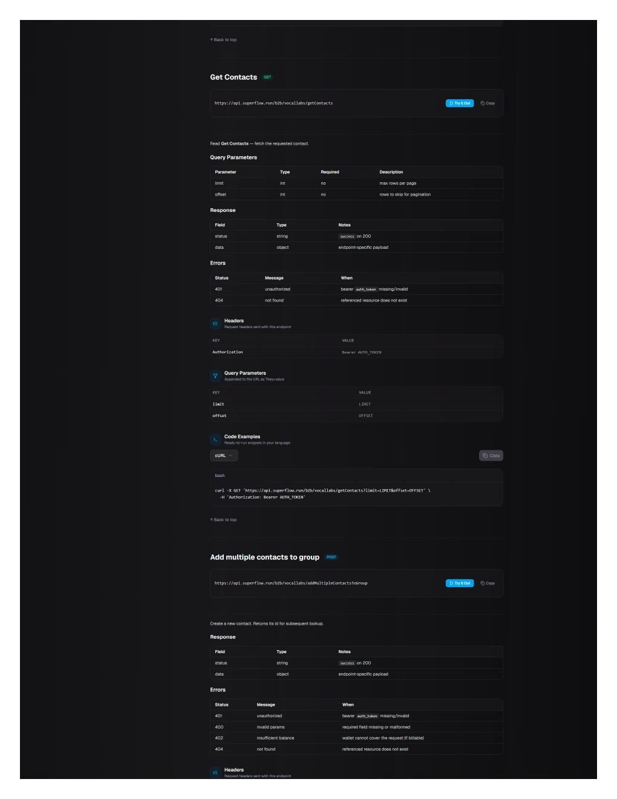
  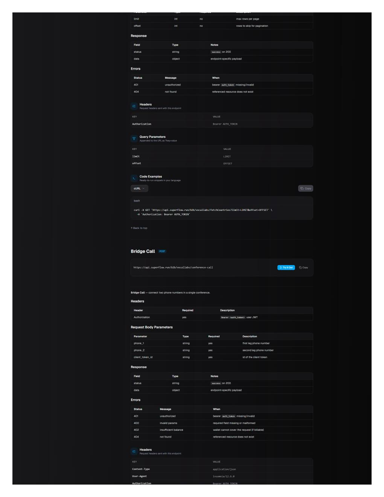
</p>

> 🔍 **What to look at:** (left) the response is a generic `object`; (middle) a POST endpoint with a GET example; (right) `User-Agent: insomnia/12.0.0` left in the public docs.

**(b) Problem.** For a company whose pitch is *"infrastructure for developers,"* **the docs *are* the product.** A developer here can log in but can't predict a single response shape, can't trust the HTTP verbs, and copies broken examples. Polished-but-hollow is arguably worse than sparse-but-honest, because it *looks* finished, so the developer wastes time discovering it isn't. This compounds F1: even if you got a key, integration is trial-and-error.

**(c) Ship instead.** Generate the docs from a real **OpenAPI spec** with typed response schemas per endpoint, real per-endpoint errors, human-written one-line descriptions, correct verbs, and strip the Insomnia `User-Agent`. Add a **"Get your API keys" quickstart** at the top (which also fixes F1).

---

### F4 · Half-duplex audio likely weakens "human-like, unscripted" calls
**Pillar:** Features / Competitor  **Severity:** 🟡 Medium  **Effort:** High

**(a) Observed.** The open-source SDK's audio config exposes **half-duplex** parameters (`halfDuplexRms`, `halfDuplexPeak`) and defaults to **8 kHz** sample rate (`sampleRate: 8000`). *To their credit,* the Android app does expose a **16 kHz** option — so audio is not hard-locked to 8 kHz.

**(b) Problem.** Half-duplex means the system struggles to listen *while* it is speaking — which makes true **barge-in / interruption** fragile. Being able to interrupt the agent naturally is exactly what separates a "human-like, unscripted" agent from an IVR phone tree, and it's directly in tension with their headline claim. **In plain terms:** if you can't smoothly talk over the agent, it feels robotic, no matter how good the voice is.

**(c) Ship instead.** Move toward **full-duplex streaming** with proper voice-activity-detection-based interruption, offer a **wideband (16 kHz+)** path wherever the carrier allows, and publish an **interruption-latency number** as a credibility signal.

> **Honesty note:** This is from the SDK code; I could not validate it on a live call because calls couldn't be provisioned (F1) and failed on the app (F8). This finding should be **verified on one working call** before the team treats it as confirmed.

---

### F5 · The public GitHub org sends an incoherent brand signal
**Pillar:** GTM / Brand  **Severity:** ⚪ Low  **Effort:** Low

**(a) Observed.** The most polished, most SEO-stuffed repo in `github.com/Vocallabsai` is **`vocalflow` — a free macOS *dictation* app** (a Wispr Flow clone), unrelated to the voice-agent business. Its README is keyword soup ("FREE FREE FREE", competitor names). Meanwhile the core SDK has no self-serve path, build binaries (`.dmg`/`.pkg`) are committed straight into git, and a stray `oplo_square.png` hints at a rebrand leftover.

**(b) Problem.** A developer who lands on the org to evaluate "Vocallabs the voice infra company" gets a confusing signal about what the company even *is*, and sees the most love went to a non-core side project. It quietly undercuts the "serious infrastructure" positioning.

**(c) Ship instead.** Move `vocalflow` to its own org (or clearly label it a Deepgram-powered demo of their audio chops), **pin the core repos** with one-line positioning, and move binaries to GitHub Releases instead of committing them.

---

### F6 · The Chrome extension is delisted and only reachable via ad-laden mirror sites
**Pillar:** Features · UX · Trust  **Severity:** 🟡 Medium  **Effort:** Low

**(a) Observed.** Vocallabs advertises a "Chrome extension for workflow automation." Its official Chrome Web Store listing now returns **"This item is not available"** (delisted or pulled). The only places it still surfaces are third-party download sites like **Softonic**, wrapped in Avast/Opera/CCleaner ads, described there as a tool to *"obtain direct contact numbers for business professionals."*

<p>
  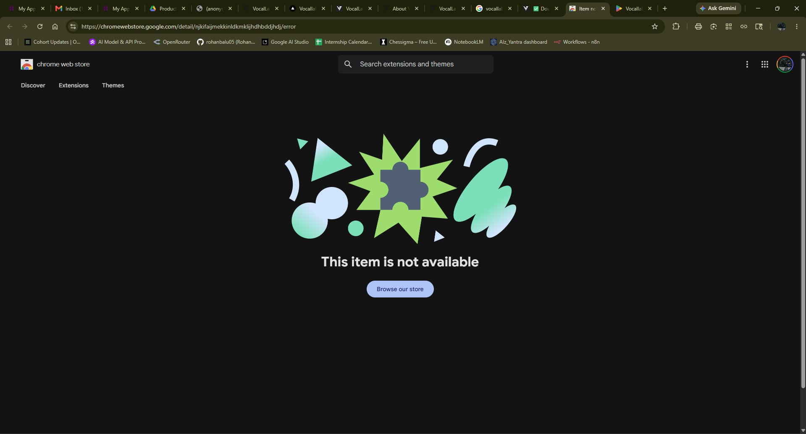
  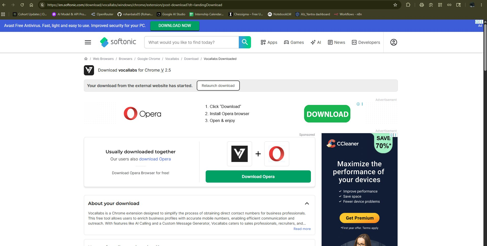
</p>

> 🔍 **What to look at:** (left) the official store listing is dead; (right) the only live copy is an ad-wrapped mirror — an uncontrolled, repackaged `.crx`.

**(b) Problem.** Three compounding issues: (1) a **publicly advertised capability is dead** through legitimate channels — a broken promise that signals neglect; (2) anyone hunting for it lands on **mirror sites serving an uncontrolled extension file**, a real security and brand risk (a trojaned clone could ship under "Vocallabs"); (3) the described purpose — scraping personal mobile numbers for outreach — is **off-strategy** for a voice-agent platform and privacy-sensitive under India's DPDP regime. *(Privacy point flagged as a risk, not legal advice.)*

**(c) Ship instead.** Decide its fate explicitly. If deprecated → remove all references from the site/brief and redirect them. If strategic → **relist on the Chrome Web Store** (own the distribution channel) and **re-scope it on-strategy** (e.g. "launch/monitor an AI voice agent from your CRM tab") rather than contact scraping.

> ⚠️ Do **not** install the mirror-site build — third-party extension repackages are a known malware vector and it is not Vocallabs' controlled artifact.

---

### F7 · A bare-bones developer test-app is shipped to the public Play Store as a "product"
**Pillar:** GTM · UX · Positioning  **Severity:** 🟡 Medium  **Effort:** Low

**(a) Observed.** The public "Vocallabs" Android app contains exactly: a phone-number field, an 8/16 kHz toggle, a "Start Call" button, a mute control, and a Disconnected/Inactive status row — with a vague Play Store description. This is an **internal SDK test client**, not a consumer product.

<p>
  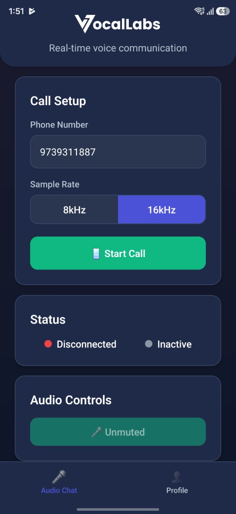
</p>

> 🔍 **What to look at:** no agent selection, no onboarding, no explanation — just a raw call tester, published as if it were the product.

**(b) Problem.** It's the same incoherence as F5/F6: a public surface that contradicts the company story and confuses positioning (is Vocallabs a consumer calling app, a dev SDK, or B2B infra?). A prospect or investor's analyst who downloads it gets something that looks purposeless — a poor, trust-eroding first impression.

**(c) Ship instead.** Unpublish it, or relabel it explicitly (e.g. "Vocallabs SDK Demo") and gate it behind the docs. A *public* app should demonstrate the real product — pick an agent, hear a real AI call — not expose a raw call tester.

---

### F8 · The core action (place a call) fails, leaking a raw backend error to the user
**Pillar:** Features · Reliability · UX (+ security)  **Severity:** 🔴 Critical  **Effort:** Medium

**(a) Observed.** Tapping **"Start Call"** in the public Android app returns a modal reading: *"Call Failed — parsing Hasura.GraphQL.Execute.Action.Types.ActionWebhookErrorResponse failed, key 'message' not found."* The one thing the app exists to do does not work, and the failure dumps an internal stack error to the end user.

<p>
  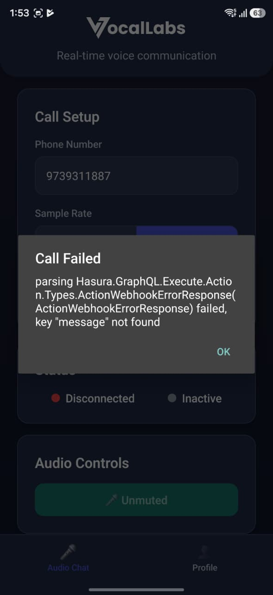
</p>

> 🔍 **What to look at:** a normal user is shown a **Hasura GraphQL** parse error. Users should never see this.

**(b) Problem.** Three layers, top to bottom:
1. **Reliability** — the headline capability fails on the primary public surface, which is awkward for a company claiming to "scale to millions of concurrent calls."
2. **Error handling** — there is no layer translating backend failures into human messages.
3. **Information disclosure** — the error reveals the stack (Hasura GraphQL + Action webhooks). *(Useful for this teardown — it confirms the Subspace/Hasura backend in F2 — but a leak Vocallabs should close.)*

**(c) Ship instead.** Wrap all backend calls in a user-facing error layer ("We couldn't connect your call — please try again"), log the raw error **server-side only**, and fix the failing `initiateCall` Action webhook (it returned an error object missing the `message` key — a contract bug between Vocallabs' own app and its own API).

---

### F9 · "Booking" agents have no scheduler; WhatsApp is notify-only; KYC has no payment rail
**Pillar:** Potential Collaborations  **Severity:** 🟡 Medium  **Effort:** High

**(a) Observed.** Across the entire API (agents, actions, library, campaigns) there is **no calendar/scheduling integration** (no Google Calendar / Cal.com / Calendly) — despite the brand selling "booking" agents. WhatsApp appears only as `updateWhatsappNotification` — a one-way **notification toggle**, not a conversational channel. They ship in-call **Aadhaar/PAN KYC** (`getIdentityUrl`) but **no payment rail** to pair with it.

**(b) Problem.** The three highest-value Indian voice workflows — *book an appointment*, *confirm/collect over WhatsApp*, *take a payment after verifying identity* — each dead-end at an integration that doesn't exist. Agents can talk, but can't **close the loop**. These are exactly the partnerships that turn a demo into ROI.

**(c) Ship instead.** Three concrete partnerships: (1) **Cal.com / Google Calendar** as a first-class agent Action, so "booking" actually books; (2) **WhatsApp Business API** as a conversational channel (handoff + confirmations), not just notifications; (3) **Razorpay / UPI** in-call payment links, leveraging the existing KYC step. The Subspace (fintech) parentage makes the payments integration especially natural.

---

### F10 · Validate (or puncture) the "emotion/tone" analytics claim on a live call *(reserved)*
**Pillar:** Competitor · Features  **Severity:** 🟡 Medium  **Effort:** —

**(a) Observed (from code).** Analytics is configured via a per-agent `analytics_prompt` and prompt-based `updatePostCallData` (you write a prompt to extract each field) on a Deepgram + LLM stack. That points to **"emotion, intent & tone beyond transcription"** being an **LLM prompt over a transcript**, not acoustic analysis of the audio.

**(b) Problem.** If true, the claim oversells what is essentially transcript summarisation — the same fragility as F2.

**(c) Ship instead / next step.** This is the one finding that needs **a single live call to confirm**. With a provisioned/demo account (or the docs "Try it Out" once credentials exist), listen for Deepgram-characteristic behaviour and test whether "emotion" reacts to *tone* vs *words*. If confirmed, it strengthens F2; if calls stay broken, **F8 stands on its own** and the analytics claim is cited as evidenced-but-unverified.

---

## 7 · Prioritisation — what to fix first, and why

Ordered by **impact on trust/revenue ÷ effort**. The logic: fix the things that make a serious evaluator walk away *today* before the strategic, slower bets.

| Priority | Findings | Why this bucket first |
|---|---|---|
| **P0 — Stop the bleeding** | **F8** (broken call), **F1** (no door), **F3** (unusable docs) | These three kill the evaluation *in the first session*. A failed call, a sales wall, and undocumented responses each independently lose a high-intent developer. All are concrete and shippable. |
| **P1 — Coherence & trust** | **F6** (dead extension), **F7** (test-app on store), **F2** (positioning) | Cheap, fast credibility wins (F6/F7) plus the strategic re-message (F2). These stop the "what *is* this company?" confusion. |
| **P2 — Depth & roadmap** | **F4** (full-duplex), **F9** (integrations), **F5** (org hygiene), **F10** (validate analytics) | Higher-effort or research-dependent. These build the *durable* product and moat once the basics hold. |

**Why F8 is #1 not F2:** F2 is the most *intellectually* interesting finding, but a prospect never reaches a moat debate if the app crashes on "Start Call." Reliability buys you the right to have the strategy conversation.

---

## 8 · What I'd genuinely keep (strengths)

A fair teardown names what's working — and Vocallabs has real assets:

- **A broad, mature B2B API.** Agents, campaigns, contact groups, a DID number marketplace, conferencing (bridge two numbers), and **custom Actions** = mid-call function-calling via `external_curl` with explicit success/failure/**interruption** responses. This is a genuinely capable platform surface.
- **RAG built in.** `insertAgentDocx` with `webcrawler_depth` lets an agent learn from crawled sites/documents.
- **Operational depth.** Keyword/pronunciation replacement, per-agent success metrics, and post-call structured-data extraction.
- **The real moat (and they're underselling it):** **in-call Aadhaar/PAN identity verification** (`getIdentityUrl`). US-centric competitors (Vapi, Retell, Bland) have nothing like it. *This* — India telephony + KYC + (proposed) payments — is the moat I'd put on the homepage, instead of "proprietary intelligence."

### Quick competitor positioning (as of early 2026, structural — not a price sheet)

| Capability | Vocallabs | Vapi | Retell | Bland | Synthflow | Sarvam (IN) |
|---|---|---|---|---|---|---|
| Self-serve signup + instant API key | ❌ | ✅ | ✅ | ✅ | ✅ | ✅ |
| Developer-first docs | 🟡 (hollow) | ✅ | ✅ | ✅ | ✅ | ✅ |
| Transparent public pricing | ❌ | ✅ | ✅ | ✅ | ✅ | ✅ |
| India languages / accents focus | ✅ (claimed) | 🟡 | 🟡 | 🟡 | 🟡 | ✅✅ |
| In-call Aadhaar/PAN KYC | ✅ | ❌ | ❌ | ❌ | ❌ | ❌ |
| Owns core models vs orchestrates | Orchestrates | Orchestrates | Orchestrates | Mixed | Orchestrates | ✅ Owns (India LLM/ASR) |

> Read this as *positioning*, not a benchmark: Vocallabs' way to win is **not** "be Vapi for India on features" — it's to own **India telephony + KYC + payments + workflow**, where it already has a head start nobody else does.

---

## 9 · Frameworks & deep dives

The supporting analysis lives in this repo:

- [`frameworks/moat-audit.md`](frameworks/moat-audit.md) — the four-moats stress test, expanded.
- [`frameworks/swot.md`](frameworks/swot.md) — SWOT.
- [`frameworks/porters-five-forces.md`](frameworks/porters-five-forces.md) — Porter's Five Forces.
- [`frameworks/prioritization-matrix.md`](frameworks/prioritization-matrix.md) — impact × effort detail.
- [`research/01-architecture-and-stack.md`](research/01-architecture-and-stack.md) — how the Subspace/Hasura/Deepgram stack was reverse-engineered.
- [`research/02-api-surface-analysis.md`](research/02-api-surface-analysis.md) — the full annotated API surface.
- [`research/03-github-org-teardown.md`](research/03-github-org-teardown.md) — repo-by-repo findings.
- [`research/04-competitor-landscape.md`](research/04-competitor-landscape.md) — competitor positioning notes.
- [`evidence/`](evidence/) — every screenshot, mapped to its finding.

---

## 10 · Repository map

```
.
├── README.md                         ← this teardown (start here)
├── evidence/
│   ├── README.md                     ← index: which screenshot proves which finding
│   └── screenshots/                  ← F1…F8 evidence images
├── research/
│   ├── 01-architecture-and-stack.md
│   ├── 02-api-surface-analysis.md
│   ├── 03-github-org-teardown.md
│   └── 04-competitor-landscape.md
└── frameworks/
    ├── moat-audit.md
    ├── swot.md
    ├── porters-five-forces.md
    └── prioritization-matrix.md
```

---

<sub>Teardown by Rohan ([@rohanbalu05](https://github.com/rohanbalu05)) · Co-founder, AIz Yantra. All findings are based on publicly available surfaces (website, app, Chrome Web Store, public API docs, and Vocallabs' own open-source repositories) exercised between 30 May 2026. Technical claims that could not be verified on a live call are explicitly flagged as such.</sub>
