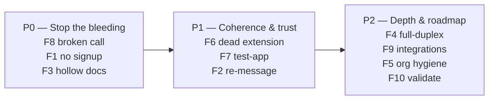

# Framework — Prioritisation matrix

> How the 10 findings were ranked, and the logic for the fix order. Method: rank by **impact on trust/revenue ÷ effort to fix**, then sequence so the things that lose an evaluator *today* are fixed before the strategic, slower bets.

## Impact × effort table

| Finding | Impact | Effort | Priority | Rationale |
|---|---|---|---|---|
| **F8** Core call fails + raw error | High | Med | **P0** | The product visibly doesn't work on its main public surface. Nothing else matters until this is fixed. |
| **F1** No self-serve signup | High | Med | **P0** | Loses the entire stated (developer) ICP at the front door. |
| **F3** Hollow API docs | High | Med | **P0** | Even with a key, integration is trial-and-error; "docs are the product" for infra. |
| **F6** Dead Chrome extension | Med | Low | **P1** | Cheap credibility + security/trust fix; a broken advertised capability. |
| **F7** Test-app on Play Store | Med | Low | **P1** | Cheap positioning fix; removes a confusing public artifact. |
| **F2** Orchestration vs "proprietary" | High | High | **P1** | Strategic re-messaging (low cost) + a longer build to make the moat real. |
| **F4** Half-duplex audio | Med | High | **P2** | Real product depth; needs engineering + live validation first. |
| **F9** Missing integrations | Med | High | **P2** | High-value partnerships (scheduler, WhatsApp, payments) but larger build. |
| **F5** Incoherent GitHub org | Low | Low | **P2** | Quick hygiene; low individual impact. |
| **F10** Validate analytics claim | Med | — | **P2** | Research/validation step, not a code fix. |

## Fix order (sequencing logic)

**Why F8 outranks F2:** F2 is the most intellectually interesting finding, but a prospect never reaches a moat debate if "Start Call" crashes. Reliability earns the right to have the strategy conversation. **First impressions (P0) gate everything downstream.**
